# engineer-training-week05

## Q2

### command

```sql
CREATE TABLE user(
-> id bigint AUTO_INCREMENT,
-> name varchar(255) NOT NULL,
-> username varchar(255) NOT NULL,
-> password varchar(255) NOT NULL,
-> time datetime NOT NULL DEFAULT CURRENT_TIMESTAMP,
-> PRIMARY KEY (id)
```

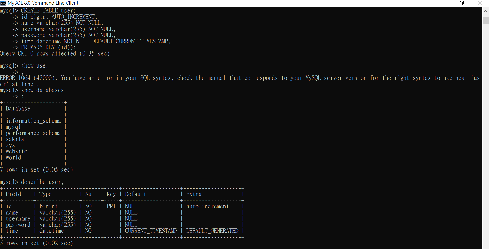

## Q3

### Q3 command 1

```sql
INSERT INTO user VALUE (1,'Amy', 'ply', 'ply','20210326');

INSERT INTO user VALUE (2,'Ben', 'qqq', 'qqq', '20210325');

INSERT INTO user VALUE (3,'Cathy', 'ccc', 'ccc', '20210324');

INSERT INTO user VALUE (4,'Diana', 'ddd', 'ddd', '20210323');

INSERT INTO user VALUE (5,'Exile', 'eee', 'eee', '20210322');
```

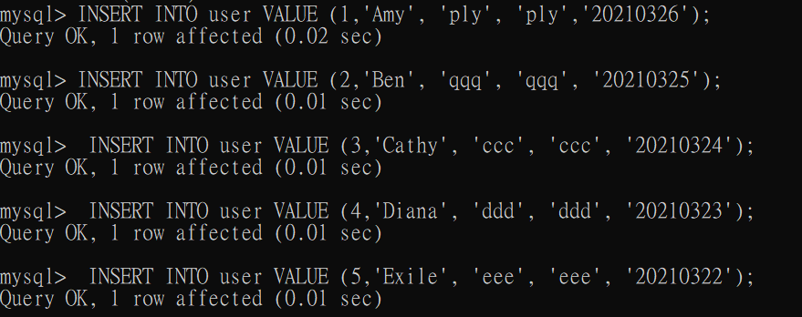

### Q3 command 2

```sql
select * from user;
```

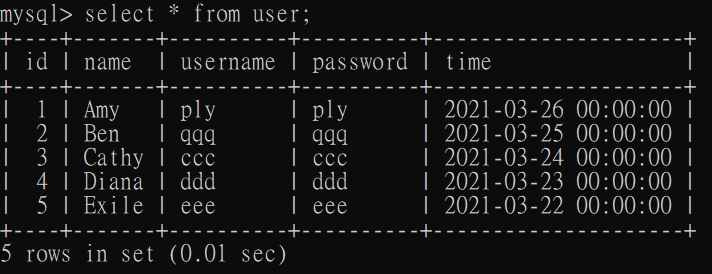

### Q3 command 3

```sql
select count(*) from user;
```

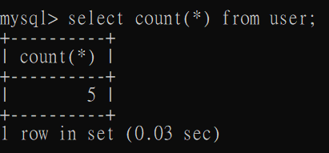

### Q3 command 4

```sql
select * from user where id between 2 and 4 order by time DESC;
```

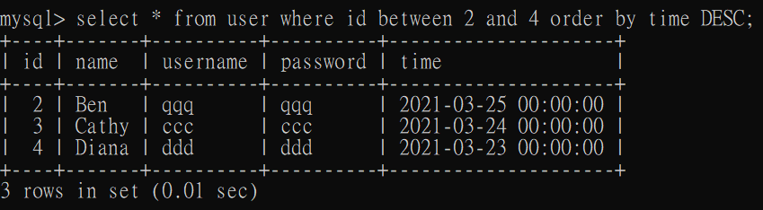

### Q3 command 5

```sql
select * from user where username = 'ply';
```

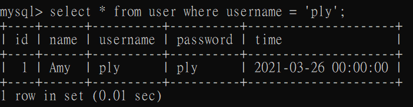

### Q3 command 6

```sql
select * from user where username = 'ply' and password = 'ply';
```

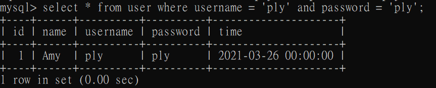

### Q3 command 7

```sql
update user set name = "丁滿" where username = 'ply';
```

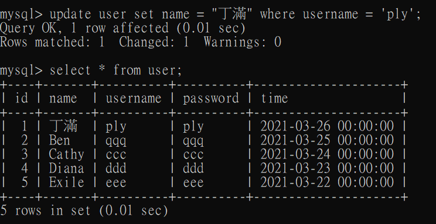

### Q3 command 8

```sql
delete from user;

```

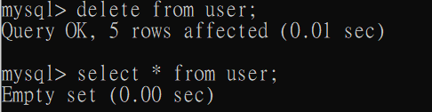

## Q4

### Q4 command 1

```sql
CREATE TABLE message(
-> id bigint AUTO_INCREMENT,
-> user_id bigint NOT NULL,
-> content varchar(255) NOT NULL,
-> time datetime NOT NULL DEFAULT CURRENT_TIMESTAMP,
-> PRIMARY KEY (id));
```


### Q4 command 2

```sql
select content, user.name 
from message join user on message.user_id = user.id;
```

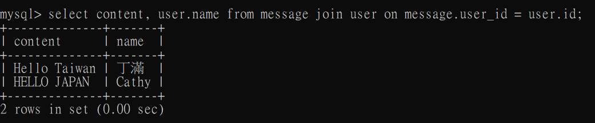


### Q4 command 3

```sql
select content, user.name 
from message 
join user 
on user.username = 'ply' and user.id = message.user_id;
```

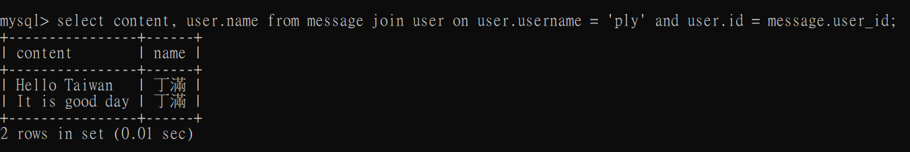
